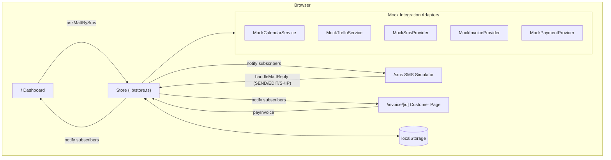
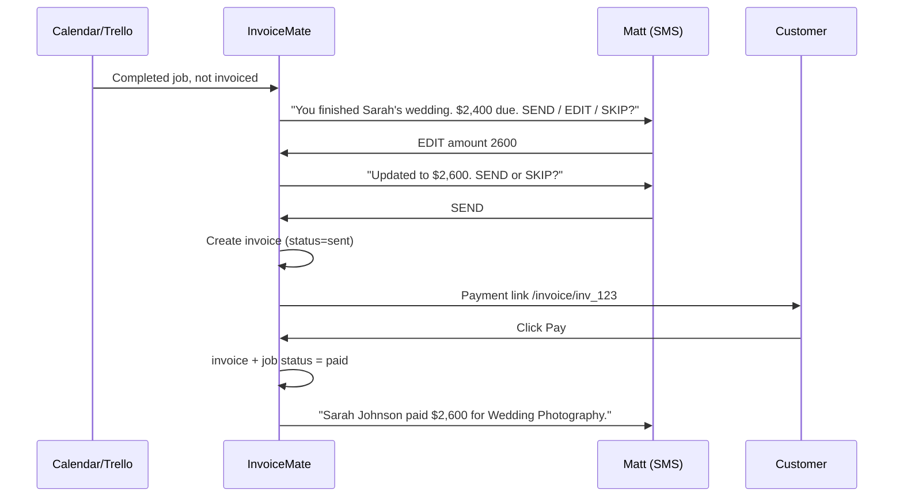
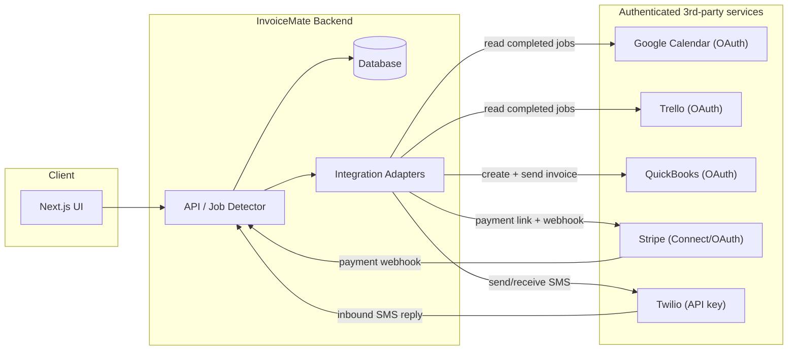
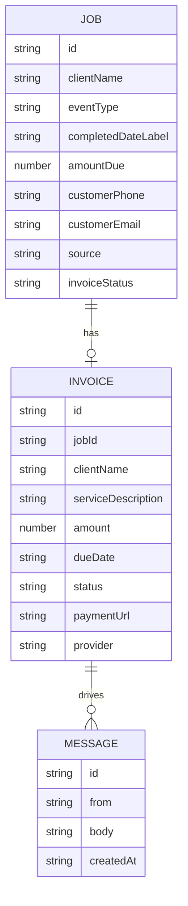

# InvoiceMate — Architecture & Docs

InvoiceMate is an **SMS invoice-approval agent** for field workers (e.g. Matt, a wedding photographer). It watches a job source (Calendar/Trello), detects completed jobs that haven't been invoiced, asks the owner for approval over SMS, creates an invoice, gives the customer a payment link, and notifies the owner when payment lands.

This doc describes both the **hackathon demo architecture** (everything mocked, runs offline and on Vercel) and the **production architecture** (real OAuth + provider integrations) that the demo is designed to grow into.

---

## 1. One-screen summary

- **Frontend:** Next.js (App Router) + TypeScript + Tailwind.
- **State (demo):** client-side store backed by `localStorage`, reactive via `useSyncExternalStore`. No backend, no API keys.
- **Integrations:** five adapter interfaces (`CalendarService`, `TrelloService`, `SmsProvider`, `InvoiceProvider`, `PaymentProvider`). The demo ships **mock** implementations; production swaps in **real** ones with no changes to UI or flow logic.
- **Deploy:** runs offline with `npm run dev`; deploys to Vercel as a zero-config client app.

---

## 2. Demo architecture (what we built for the hackathon)

Everything is in the browser. State lives in `localStorage` and updates live across pages/tabs via the `storage` event.



Key point: the **store and adapter boundary is identical** to what production uses. Only the adapter implementations differ.

---

## 3. End-to-end flow (sequence)



---

## 4. Production architecture (what the adapters plug into)

In production the same flow runs server-side. The customer/owner **authenticate via OAuth** with the services they already use; InvoiceMate stores tokens and calls the real APIs through the same adapter interfaces.



### Authentication model

- **Google Calendar / Trello:** owner connects via OAuth 2.0; InvoiceMate stores refresh tokens and polls (or subscribes to webhooks) for completed jobs.
- **QuickBooks:** OAuth 2.0; invoices are created and sent through the owner's real accounting system.
- **Stripe:** OAuth / Stripe Connect for the owner's account; customer pays via hosted checkout; payment confirmation arrives via webhook.
- **Twilio:** API credentials for outbound SMS to Matt and inbound reply parsing (the same SEND/EDIT/SKIP grammar used in the demo).

---

## 5. Adapter pattern (demo ↔ production swap)

Every integration is hidden behind an interface, so swapping mock for real is a one-line wiring change.

```ts
interface CalendarService { getCompletedJobs(): Promise<Job[]>; }
interface TrelloService   { getCompletedJobs(): Promise<Job[]>; }
interface SmsProvider     { sendMessage(to: string, body: string): Promise<void>; }
interface InvoiceProvider { createInvoice(job: Job): Promise<Invoice>; }
interface PaymentProvider { markPaid(invoiceId: string): Promise<void>; }
```

- **Demo:** `MockCalendarService`, `MockSmsProvider`, etc. return seed data and mutate `localStorage`.
- **Production:** `GoogleCalendarService`, `TwilioSmsProvider`, `QuickBooksInvoiceProvider`, `StripePaymentProvider` call real APIs behind the **same** method signatures.

---

## 6. Data model



---

## 7. Why this matters

We did not build another invoice app. We built an **SMS approval agent** for people who are away from their computer. The owner already has the job details in Calendar/Trello — the friction is *remembering to invoice*. InvoiceMate closes the gap between job-complete and invoice-sent, with the owner approving everything by text. For the hackathon, Twilio, QuickBooks, Stripe, Calendar, and Trello are mocked, but the integration points are designed as **replaceable, authenticated adapters**.
